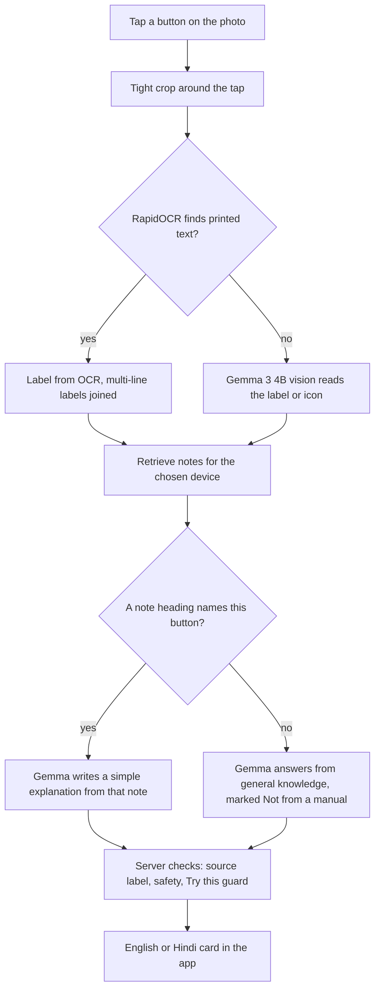

# Explain This Thing

**Take a photo of a remote or control panel, tap the button you forgot, and get a simple explanation in English or Hindi. It runs entirely on your own computer with open-weight AI.**

[](https://hacktoberfest.com)
[](https://dev.to)
[](LICENSE)


## Why I built it

My parents sometimes forget what a button on a remote or a control panel does. Until now the answer was "ask me", or ask someone else. I wanted them to be able to look it up themselves: take a photo, tap the button, read a short plain-language answer.

I tested it with my parents. Their feedback was that it helped them understand buttons without needing me or anyone else to explain them, and that they could quickly look a button up on their own when they forgot what it did. That independence is the whole point of the project.

It is **not** a generic assistant for every appliance. It is deliberately built around the devices one real person uses, so the answers can be checked against notes written for those devices.

### Supported devices

| Device | Notes folder |
|---|---|
| AC remote | `data/appliances/ac_remote/` |
| Dishwasher | `data/appliances/dishwasher/` |
| Panasonic microwave (NN-CT641M) | `data/appliances/microwave/` |
| Samsung TV remote (BN59-01315M) | `data/appliances/tv_remote/` |

You can also upload a photo of any other remote or panel. You still get an explanation from Gemma's general knowledge, but it is clearly marked as **not from a manual** (see [Honesty about sources](#honesty-about-sources)).

---

## What it does

- Pick a saved device, or upload or take a photo of any remote or panel
- Tap a button on the photo
- Get a card with the button name, **what it does** and **what to try**
- English and Hindi (हिन्दी) explanations
- A confidence label and a source label on every answer
- Read-aloud for the explanation
- 👍 / 👎 feedback buttons
- A "Technical details" panel showing the crop the model looked at, what was read, timings and retrieved notes

---

## Why open-weight AI matters here

This project exists in the form it does because the AI is open and local:

- **Privacy.** Photos of someone's home and devices never leave the computer. The flow is `browser → local FastAPI → local Ollama → local model`, not a third-party cloud API. The explain endpoint does not write uploaded photos to disk, and the request log stores timings and answers, not images.
- **No per-request cost.** Nothing is billed per question, so my parents can ask as often as they like.
- **Works offline.** After the models are downloaded once (and RapidOCR's models ship inside its pip package) the app needs no internet.
- **Control.** I can read, change and test every part: the prompts, the retrieval rules and the notes. The model can be swapped for another one in Ollama by changing an environment variable.
- **Customisable for one person.** The knowledge base is just Markdown files for the devices my parents use. Adding or correcting a button is editing a text file.

### How Gemma 3 4B is used

`gemma3:4b` (via Ollama) does three jobs:

1. **Vision fallback**: reads the label or icon of the tapped button when OCR finds no printed text.
2. **Writes the explanation** in simple English or Hindi.
3. **Returns structured JSON** (enforced with a JSON schema) so the app can show the answer reliably.

`nomic-embed-text` embeds the notes and the button label for retrieval. RapidOCR reads printed labels quickly on CPU.

---

## How it works



Retrieval only runs when a saved device is selected. For an uploaded photo of an unknown device, the answer comes from Gemma's general knowledge and is labelled that way.

## Tech stack

| Layer | Technology |
|---|---|
| Frontend | React, Vite, TypeScript |
| Backend | Python, FastAPI, Uvicorn |
| LLM and vision | Gemma 3 4B (`gemma3:4b`) through Ollama |
| Embeddings | `nomic-embed-text` through Ollama |
| OCR | RapidOCR (ONNX Runtime) |
| Retrieval | Cosine similarity over embeddings in memory, cached to `data/index/` |
| Tests | pytest |

---

## Project structure

```
.
├── backend/
│   ├── app/
│   │   ├── main.py          # FastAPI routes
│   │   ├── explain.py       # the tap -> explanation pipeline
│   │   ├── prompts.py       # prompts and JSON schemas
│   │   ├── ollama_client.py # talks to local Ollama
│   │   ├── ocr.py           # RapidOCR label reading and line grouping
│   │   ├── retrieval.py     # embedding search over a device's notes
│   │   ├── ingest.py        # splits notes into chunks and embeds them
│   │   ├── textutils.py     # heading matching, Hindi check, "Try this" guard
│   │   ├── safety.py        # unsafe-topic detection
│   │   ├── schemas.py       # Pydantic models
│   │   ├── config.py        # settings and environment variables
│   │   ├── feedback.py      # request and feedback logging
│   │   └── tracing.py       # optional tracing hooks
│   └── tests/
├── frontend/
│   └── src/
│       ├── App.tsx
│       ├── api.ts
│       ├── i18n.ts          # English and Hindi interface text
│       ├── types.ts
│       ├── pages/Home.tsx
│       └── components/      # AnswerCard, TapImage, LanguageToggle, SourceBadge
└── data/
    ├── appliances/
    │   ├── ac_remote/
    │   ├── dishwasher/
    │   ├── microwave/
    │   └── tv_remote/
    │       ├── appliance.json
    │       ├── panel.jpg
    │       └── knowledge/notes.md
    ├── index/               # generated embeddings
    └── logs/                # generated request and feedback logs
```

The panel photos are third-party product images. If you fork this project, replace them with your own photos or images you are allowed to use.

---

## Getting started

Everything runs locally. There is no cloud deployment.

### Requirements

- Python 3.11 or newer
- Node.js 18 or newer
- [Ollama](https://ollama.com/download)
- A computer with about 8 GB of free RAM. A GPU is not required.

### 1. Download the models

```bash
ollama pull gemma3:4b
ollama pull nomic-embed-text
```

Check that `gemma3:4b` lists **vision** under capabilities with `ollama show gemma3:4b`.

### 2. Start the backend

From the project root (Windows PowerShell):

```powershell
python -m venv .venv
.\.venv\Scripts\python.exe -m pip install -r backend/requirements.txt
.\.venv\Scripts\python.exe -m pip install rapidocr onnxruntime   # skip if already in requirements.txt
.\.venv\Scripts\python.exe -m uvicorn backend.app.main:app --host 127.0.0.1 --port 8000
```

On macOS or Linux, use `source .venv/bin/activate` and `python` in place of `.\.venv\Scripts\python.exe`.

RapidOCR is optional but strongly recommended. Without it, every tap uses Gemma vision and is much slower. To turn it off on purpose, set `USE_OCR=0`.

### 3. Start the frontend

```bash
cd frontend
npm install
npm run dev
```

Open the address Vite prints (normally http://localhost:5173). The dev server forwards `/api` and `/static` to the backend on port 8000.

Make sure Ollama is running before you tap a button.

### 4. Run the tests

```powershell
.\.venv\Scripts\python.exe -m pytest backend/tests
```

---

## Using the app

1. Choose a language with the English / हिन्दी toggle.
2. Take or upload a photo, or pick one of the saved devices. A saved device also switches on its notes.
3. Optionally tell the app what kind of device it is. This helps for photos of devices without notes.
4. Tap the button you want explained.
5. Press **Explain this button** and read the card. Open **Technical details** to see what the model looked at.

---

## Adding your own device

You do not need to change any code.

1. Create a folder `data/appliances/<your_device>/` with a `knowledge/` folder inside.
2. Add `appliance.json`:

   ```json
   {
     "id": "your_device",
     "name": "Kitchen Mixer",
     "brand": "Brand",
     "model": "Model",
     "type": "Mixer",
     "panel_image": "panel.jpg",
     "language_default": "en"
   }
   ```

3. Add a photo of the panel as `panel.jpg`.
4. Write `knowledge/notes.md`, **one heading per button, named with the words printed on the button**, followed by one or two plain sentences:

   ```markdown
   ## Fan speed
   Changes how strongly the air blows. Press it again and again to go from low to high.
   ```

   The heading matters: a note is only used when its heading shares a word with the label that was read from the button.

5. Index the notes by uploading them to the running backend (this also saves the file):

   ```powershell
   curl.exe -X POST -F "file=@data/appliances/your_device/knowledge/notes.md" http://127.0.0.1:8000/api/appliances/your_device/knowledge
   ```

Reload the app and your device appears in the list.

Please do not commit copyrighted manuals or photos you do not have the right to share.

---

## API

| Method and path | What it does |
|---|---|
| `GET /api/health` | Whether Ollama is reachable, and which models are configured |
| `GET /api/appliances` | Saved devices, with how many note sections each has |
| `POST /api/appliances` | Create a device (form fields and an optional photo) |
| `POST /api/appliances/{id}/knowledge` | Add a notes file and re-index it |
| `POST /api/explain` | Explain a tapped button |
| `POST /api/feedback` | Record a 👍 / 👎 |

`POST /api/explain` takes a multipart form: `x` and `y` (the tap, as fractions from 0 to 1), `language` (`en` or `hi`), and optionally `image`, `appliance_id`, `appliance_type`, `question` and `use_kb`. It returns the card (`button_name`, `what_it_does`, `try_this`, `confidence`, `source`, `source_ref`, `safety_flag`), what was read from the button, the retrieved notes with their scores, per-step timings and the crop that was analysed.

### Settings

| Environment variable | Default | Purpose |
|---|---|---|
| `OLLAMA_VISION_MODEL` | `gemma3:4b` | Model used for vision and for writing explanations |
| `OLLAMA_EMBED_MODEL` | `nomic-embed-text` | Embedding model |
| `OLLAMA_HOST` | `http://localhost:11434` | Where Ollama is running |
| `USE_OCR` | `1` | Set to `0` to skip RapidOCR |
| `READ_CROP_TIGHT` / `READ_CROP_WIDE` | `0.16` / `0.30` | Crop size as a fraction of the image |
| `MIN_RETRIEVAL_SCORE` | `0.40` | Minimum embedding score for a note to be considered |
| `SENTRY_DSN` | unset | Enables optional tracing when set |

---

## Contributing

Contributions are welcome, especially during Hacktoberfest. Good first contributions:

- **Add a device.** Write `appliance.json` and a `notes.md` for a remote or panel you know well (see [Adding your own device](#adding-your-own-device)).
- **Improve a note.** Fix a button description or make it simpler.
- **Check or improve the Hindi text** in `frontend/src/i18n.ts`.
- **Add tests**, for example for label grouping in `backend/app/ocr.py` or heading matching in `backend/app/textutils.py`.
- **Report a button that was read wrongly,** with the screenshot and the "Technical details".

Before opening a pull request, run the tests and keep notes in plain, simple language. Please do not add copyrighted manuals or photos.

---

## Acknowledgements

- [Gemma](https://ai.google.dev/gemma) by Google (please follow the Gemma Terms of Use)
- [Ollama](https://ollama.com) for running the models locally
- [nomic-embed-text](https://ollama.com/library/nomic-embed-text) for embeddings
- [RapidOCR](https://github.com/RapidAI/RapidOCR) for text recognition
- [FastAPI](https://fastapi.tiangolo.com), [React](https://react.dev) and [Vite](https://vite.dev)
- My parents, for testing it and for being the reason it exists

## License

MIT. See `LICENSE`.
